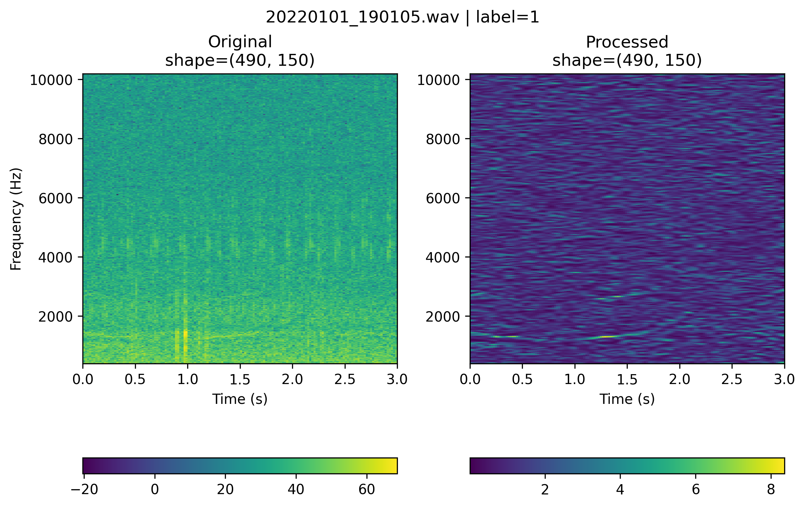
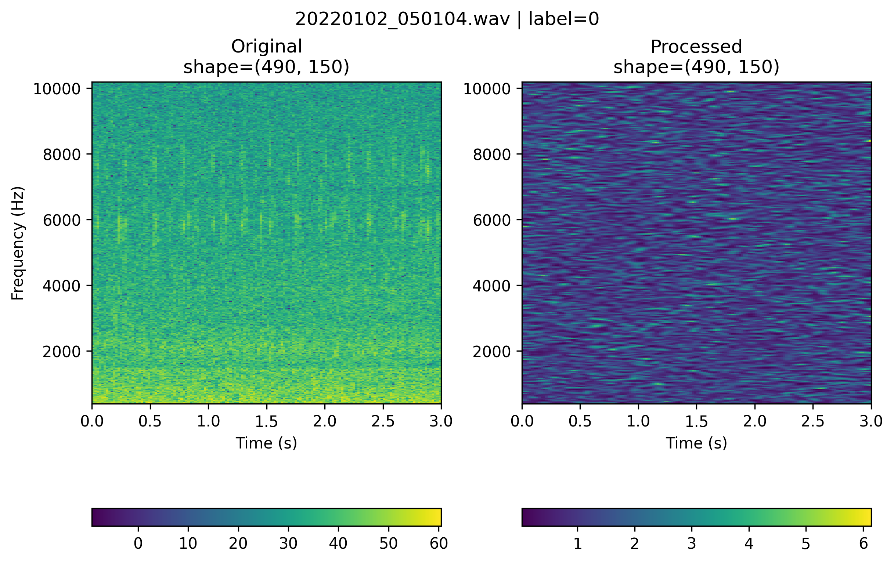

# Spectrogram Processing (**SpecPro**) Pipeline

A Python-based spectrogram enhancement and denoising pipeline for **Passive Acoustic Monitoring (PAM)** data stored in **Ketos-compatible HDF5 databases**.

The pipeline applies a multi-stage signal-processing workflow to each spectrogram, including:

* **Input sanitization** — handles NaN, infinite, and excessively small values
* **Pre-whitening** — reduces low-frequency (red) noise and flattens the spectrum
* **Time-frequency Wiener-like filtering** — enhances signal-to-background contrast using an estimate of the local signal/noise structure
* **2-D wavelet denoising** — reduces white noise while preserving localized acoustic structures
* **Spectrogram resizing** — converts processed spectrograms to user-specified dimensions

Selected processing stages can be followed by refinement operations, including:

* **SVD-based background removal**
* **Gaussian smoothing**

The pipeline supports **multiprocessing**, allowing independent spectrograms to be processed concurrently using multiple CPU workers.

The original HDF5 database is opened in **read-only mode** and is never modified. A new timestamped HDF5 database is created containing the processed spectrograms and the original metadata/non-data fields.

The processing script also provides:

* Live progress monitoring
* Detailed logging
* Per-spectrogram processing-time tracking
* Error capture and traceback recording
* Periodic output-database flushing
* Processing throughput statistics
* Final performance summary
* Optional CSV error report

---

> [!IMPORTANT]
> **The processing pipeline must be tested and optimized for each project and dataset.**
>
> Processing parameters and the order of processing stages should be evaluated using representative samples before processing the complete database of a new project. In particular, users should evaluate:
* Noise suppression
* Signal preservation
* Spectral distortion
* False enhancement of background artefacts
* Effect of resizing
* Effect of SVD background removal
* Effect of Gaussian smoothing
* Effect of wavelet thresholding
  
> Parameters can be adjusted using the command-line interface (CLI)

> Modifications to the processing stages or their order require updating the `pam_processing_pipline.py` module.

---

## Table of Contents

* [Overview](#overview)
* [Processing Pipeline](#processing-pipeline)
* [Multiprocessing Architecture](#multiprocessing-architecture)
* [Error Handling](#error-handling)
* [Command-Line Usage](#command-line-usage)
* [Installation](#installation)
* [Author](#author)
* [License and Disclaimer](#license-and-disclaimer)

---

# Overview

The processing architecture consists of three Python modules:

```text
 ┌──────────────────────────────────────────────┐
 │          RUN_PROCESSING_PIPELINE.PY          │
 │                                              │
 │  CLI • HDF5 I/O • multiprocessing            │
 │  progress • logging • error tracking         │
 └──────────────────────────────────────────────┘
                        ▲
                        |
 ┌──────────────────────────────────────────────┐
 │         PAM_PROCESSING PIPELINE.PY           │
 │                                              │
 │  EnhanceSNR transformation and processing    │
 │  sequence                                    │
 └──────────────────────────────────────────────┘
                        ▲
                        | 
 ┌──────────────────────────────────────────────┐
 │         PAM_PROCESSING_FUNCTIONS.PY          │
 │                                              │
 └──────────────────────────────────────────────┘
```

## Module Responsibilities

| Module                        | Purpose                                                                                                                                     |
| ----------------------------- | ------------------------------------------------------------------------------------------------------------------------------------------- |
| `run_processing_pipeline.py`  | Command-line interface, HDF5 database management, multiprocessing, progress monitoring, logging, error tracking, and performance statistics |
| `pam_processing_pipline.py`   | Defines the `EnhanceSNR` transformation and processing sequence                                                                             |
| `pam_processing_functions.py` | Implements the individual signal-processing functions                                                                                       |

---

# Processing Pipeline

The pipeline automatically searches the input HDF5 database for a table containing the **Ketos-specific** `audio_repres` attribute.

## HDF5 Database Structure

```text
database.h5
│
└── /<species>
    └── data                    ← PyTables/Ketos table
        ├── data                ← spectrogram array
        ├── label               ← class label
        ├── filename            ← source audio file
        └── ...                 ← additional metadata
            │
            └── Attributes
                ├── audio_repres    ← Ketos MagSpectrogram configuration
                ├── data_name       ← ['data']
                └── unique_labels   ← available class labels
```

Each row contains one spectrogram sample and its associated metadata.

The `audio_repres` attribute stores the Ketos-specific spectrogram configuration, including information such as:

* Frequency resolution
* Time resolution
* Frequency range
* Window configuration
* Spectrogram preprocessing information

The **first table** containing the `audio_repres` attribute is selected for processing. If no suitable table is found, the pipeline raises:

```text
Could not find a table with 'audio_repres' attribute.
```

---

## Input Sanitization

Each spectrogram is converted to `float32` and sanitized before processing.

Conceptually:

```python
Sxx = np.asarray(rep.data, dtype=np.float32)
Sxx = np.nan_to_num(Sxx, nan=0.0, posinf=0.0, neginf=0.0)
Sxx = np.maximum(Sxx, 1e-12)
```

This prevents:

* NaN values
* Positive infinity
* Negative infinity
* Extremely small numerical values

from propagating through subsequent processing stages.

---

## Enhancement Stages

Each spectrogram passes through the configured `EnhanceSNR` processing sequence.

The general workflow is:

```text
                             Input Spectrogram
                                      │
                                      ▼

                 ┌─────────────────────────────────────────┐
                 │ INPUT SANITIZATION                      │
                 │ • NaN / Inf handling                    │
                 │ • Minimum-value clamp                   │
                 └────────────────────┬────────────────────┘
                                      │
                                      ▼
                 ┌─────────────────────────────────────────┐
                 │ PRE-WHITENING                           │
                 │ • Red-noise reduction                   │
                 └────────────────────┬────────────────────┘
                                      │
                                      ▼
                 ┌─────────────────────────────────────────┐
                 │ REFINEMENT                              │
                 │ • SVD filter                            │
                 │ • Gaussian smoothing                    │
                 └────────────────────┬────────────────────┘
                                      │
                                      ▼
                 ┌─────────────────────────────────────────┐
                 │ WIENER FILTERING                        │
                 │ • Iterative adaptive S/N gain           │
                 └────────────────────┬────────────────────┘
                                      │
                                      ▼
                 ┌─────────────────────────────────────────┐
                 │ REFINEMENT                              │
                 │ • Gaussian smoothing                    │
                 └────────────────────┬────────────────────┘
                                      │
                                      ▼
                 ┌─────────────────────────────────────────┐
                 │ WAVELET DENOISING                       │
                 │ • 2-D coefficient thresholding          │
                 └────────────────────┬────────────────────┘
                                      │
                                      ▼
                 ┌─────────────────────────────────────────┐
                 │ REFINEMENT                              │
                 │ • Gaussian smoothing                    │
                 └────────────────────┬────────────────────┘
                                      │
                                      ▼
                 ┌─────────────────────────────────────────┐
                 │ NUMERICAL CLEANUP                       │
                 │ • Finite values                         │
                 │ • Data validation                       │
                 └────────────────────┬────────────────────┘
                                      │
                                      ▼
                 ┌─────────────────────────────────────────┐
                 │ OPTIONAL RESIZE                         │
                 │ • User-defined dimensions               │
                 └────────────────────┬────────────────────┘
                                      │
                                      ▼
                          **Enhanced Spectrogram**
```

The processing sequence is defined by `EnhanceSNR` in:

```text
pam_processing_pipline.py
```
---
<br>

A comparative example of raw and processed spectrograms, using the default processing parameters, for positively and negatively annotated data from the Baffin Bay dataset is shown below.

<table>
<tr>
<td align="center">

**Positive annotation**



<br><br>

**Negative annotation**



</td>
</tr>
</table>


# Multiprocessing Architecture

Spectrogram processing is embarrassingly parallel because each spectrogram can be processed independently.

The processing architecture is therefore:

```text
                       Input HDF5
                           │
                           │ read-only
                           ▼
                  ┌─────────────────┐
                  │ Main Process    │
                  │                 │
                  │ HDF5 writer     │
                  │ Progress bar    │
                  │ Logging         │
                  └────────┬────────┘
                           │
                 spectrogram indices
                           │
          ┌────────────────┼────────────────┐
          │                │                │
          ▼                ▼                ▼
     ┌─────────┐      ┌─────────┐      ┌─────────┐
     │ Worker 1│      │ Worker 2│ ...  │ Worker N│
     │         │      │         │      │         │
     │ HDF5 R/O│      │ HDF5 R/O│      │ HDF5 R/O│
     │ Enhance │      │ Enhance │      │ Enhance │
     │ SNR     │      │ SNR     │      │ SNR     │
     └────┬────┘      └────┬────┘      └────┬────┘
          │                │                │
          └────────────────┼────────────────┘
                           │
                     results/errors
                           │
                           ▼
                  ┌─────────────────┐
                  │ Main Process    │
                  │                 │
                  │ Write output    │
                  │ HDF5 database   │
                  └─────────────────┘
```

### Worker processing

Each worker:

1. Opens the input HDF5 database.
2. Locates the spectrogram table.
3. Creates its own `EnhanceSNR` instance.
4. Reads an individual spectrogram.
5. Processes the spectrogram.
6. Returns the processed data and processing status.

The main process then writes the result to the output database.

---

# Error Handling

Errors are handled at the individual spectrogram level.

A failure in one worker does **not normally terminate the entire processing run**. When possible, the original spectrogram is copied to the output database so that the output table maintains the same row alignment as the input.

For example:

```text
Input row 3821
      │
      ▼
EnhanceSNR
      │
      ├── SUCCESS ──► enhanced spectrogram
      │
      └── ERROR ───► original spectrogram
                         +
                      error report
```

If the original spectrogram cannot be written because its dimensions do not match the requested output dimensions, the row may be skipped and the problem is recorded in the log. Therefore, after processing, users should always check the final performance summary.

---


# Command-Line Usage

The main database-processing script is:

```text
run_processing_pipeline.py
```

## Basic Usage

```bash
python run_processing_pipeline.py input.h5 output.h5 [optional arguments]
```

The script will:

1. Locate the Ketos spectrogram table.
2. Create a timestamped output database.
3. Start the requested number of worker processes.
4. Process all spectrograms.
5. Display a live progress bar.
6. Write detailed logs.
7. Save processing errors, if any.
8. Produce a final performance summary.

---

## Example

```bash
python run_processing_pipeline.py input.h5 output.h5 --k 1.0 --perc 50 --threshold_scale_ft 0.7 --kernel_size 0.8 0.4 --n_iter 2 --resize 240 240 --workers 8
```

---

## Command-Line Arguments

| Option                    | Description                                        |       Default |
| ------------------------- | -------------------------------------------------- | ------------: |
| `input_database`          | Input Ketos HDF5 database                          |             — |
| `output_database`         | Base name/path for output HDF5 database            |             — |
| `--k`                     | Softplus compression scaling                       |           `2` |
| `--perc`                  | Percentile for compression threshold               |          `90` |
| `--kernel_size FREQ TIME` | Gaussian smoothing parameters (frequency, time)    |     `0.8 0.4` |
| `--flag_svd`              | Enable SVD background removal (`1`/`0`)            |           `0` |
| `--flag_S`                | Enable softplus compression (`1`/`0`)              |           `0` |
| `--flag_G`                | Enable Gaussian smoothing (`1`/`0`)                |           `1` |
| `--n_iter`                | Number of Wiener-filter iterations                 |           `2` |
| `--wavelet`               | Wavelet used for 2-D denoising                     |         `db4` |
| `--wavelet_level`         | Wavelet decomposition levels                       |     Automatic |
| `--wavelet_mode`          | Thresholding mode: `soft` or `hard`                |        `soft` |
| `--threshold_scale_ft`    | Wavelet threshold scaling                          |         `1.0` |
| `--resize FREQ TIME`      | Output spectrogram dimensions                      |          None |
| `--workers`               | Number of multiprocessing workers                  | CPU count − 1 |
| `--chunksize`             | Number of indices submitted to a worker at once    |           `1` |
| `--flush_interval`        | Number of written rows between HDF5 flushes        |         `100` |
| `--log_level`             | Logging level: `DEBUG`, `INFO`, `WARNING`, `ERROR` |        `INFO` |

---

**A few notes on performance and logging**

--workers: More workers do not necessarily mean faster processing. Performance depends on CPU/RAM resources, HDF5 I/O, spectrogram size, and pipeline complexity.

--chunksize: The default 1 provides fine-grained task scheduling and responsive progress tracking. Larger values can reduce multiprocessing overhead but may reduce scheduling flexibility.

--log_level: Use DEBUG for detailed diagnostics or WARNING for less verbose console output. A persistent log file is generated for every processing run.

--flush_interval: Controls how frequently the output HDF5 table is flushed to disk. The default is 100 rows. Larger values can reduce I/O overhead for large datasets, while smaller values provide more frequent persistence.

---
<br>

> [!IMPORTANT]
> ### ⚠️ Softplus Compression
>
> **Softplus compression is disabled by default (`flag_S=0`).**
>
> It is intended for **visual enhancement only** and is **NOT RECOMMENDED** when preprocessing data for deep learning applications.


<br>

---
# Installation

It is recommended to create a virtual environment before installing the required packages listed in the requirements.txt file.

1. [Download](https://www.python.org/downloads/) and install `Python` if it is not already installed.
2.	Install virtualenv (if needed; on UNIX-based systems): `sudo apt install python3-venv` 
3.	Create a virtual environment: `python3 -m venv myenv` 
4.	Activate it: `source myenv/bin/activate` on UNIX-based systems OR `myenv\Scripts\activate` on Windows
5.	Install packages: `pip install -r requirements.txt`
6.	Deactivate: `deactivate`

---

# Author

**Farid Jedari-Eyvazi, PhD**

Senior Data Scientist / Machine Learning Engineer

---

# License and Disclaimer

This tool is licensed under the [GNU General Public License v3.0](https://www.gnu.org/licenses/gpl-3.0.html) (GPLv3).

This software is provided **"as-is"**, without warranty of any kind, either express or implied, including but not limited to warranties of merchantability, fitness for a particular purpose, or non-infringement.

By using this tool, you acknowledge and accept all risks associated with its use. Please refer to the full GPLv3 license text for additional details regarding usage, modification, and redistribution.

---
